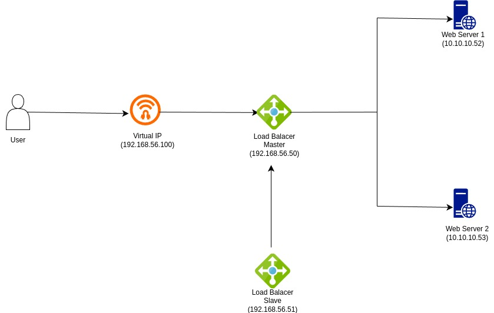

# High Availability

## What is High Availability?

High Availability (HA) refers to systems that are designed to be operational and accessible for a high percentage of time, minimizing downtime and ensuring continuous service availability. This is often achieved through redundancy, failover mechanisms, and load balancing.

## Key Components in this setup

- **Apache** (Web Server)
  Acts as the backend server that processes HTTP requests and serves web content. In this setup, multiple Apache web servers are used to serve the same content, ensuring that if one server fails, another can continue serving users without disruption.
- **Nginx** (Load Balancer)  
   Sits in front of the web servers and distributes incoming client requests across multiple backend Apache servers. This helps balance the load, prevent any single server from being overwhelmed, and improves the responsiveness of the web service
- **Keepalived** (Failover Management)
  Works together with Nginx to provide fault tolerance. It manages a Virtual IP Address (VIP) that floats between two Nginx instances (Master and Backup). If the master load balancer fails, Keepalived promotes the backup node to master and assigns the VIP to it, ensuring uninterrupted access for users.

## Objectives of This Module?

In this module, we will implement a High Availability Web Server Architecture that ensures reliable and uninterrupted web service delivery through the combination of load balancing, redundancy, and failover mechanisms.

### Network Topology

The following diagram illustrates the high-level architecture of the High Availability Web Server setup


### Description

- Client sends request to the Virtual IP (VIP) managed by Keepalived.

- The VIP routes traffic to one of the Load Balancer nodes (Nginx):

  - If Load Balancer Master is available, it handles the traffic.

  - If the Master fails, Keepalived shifts the VIP to the Backup node.

- Nginx forwards the request to one of the two Apache Web Servers, which serve the actual web content.

- Keepalived ensures failover between the two Load Balancer nodes without service disruption.

---

## Lab Environment

| No  | Virtual Machine      | Spesifikasi      | NAT  | Host-Only        | Internal Network |
| --- | -------------------- | ---------------- | ---- | ---------------- | ---------------- |
| 1   | Load Balancer Master | 1 vCPU, 1 GB RAM | DHCP | 192.168.56.50/24 | 10.10.10.50/24   |
| 2   | Load Balancer Slave  | 1 vCPU, 1 GB RAM | DHCP | 192.168.56.51/24 | 10.10.10.51/24   |
| 3   | Web Server 1         | 1 vCPU, 1 GB RAM | DHCP | 192.168.56.52/24 | 10.10.10.52/24   |
| 4   | Web Server 2         | 1 vCPU, 1 GB RAM | DHCP | 192.168.56.53/24 | 10.10.10.53/24   |

---

## Installation and Configuration Steps

### 1. Configure VM Network Interfaces

Each VM must be configured with three interfaces: NAT, Host-Only, and Internal Network.
Edit file:

```bash
sudo vim /etc/netplan/50-cloud-init.yaml
```

Example configuration for Load Balancer Master:

```yaml
# This file is generated from information provided by the datasource. Changes
# to it will not persist across an instance reboot. To disable cloud-init's
# network configuration capabilities, write a file
# /etc/cloud/cloud.cfg.d/99-disable-network-config.cfg with the following:
# network: {config: disabled}
network:
  ethernets:
    enp0s3: # NAT Interface (DHCP)
      dhcp4: true
    enp0s8: # Host-Only Interface (Static IP)
      addresses:
        - 192.168.56.50/24
      dhcp4: false
    enp0s9: # Internal Network Interface (Static IP)
      addresses:
        - 10.10.10.50/24
      dhcp4: false
  version: 2
```

Apply the configuration changes

```bash
sudo netplan apply
```

📝 Repeat this step on each VM, adjusting the IP addresses based on the table above.

### 2. Set Hostname for Each VM

Assign a unique hostname to each virtual machine based on its role, to help easily identify them

```bash
# For Load Balancer Master
sudo hostnamectl set-hostname lb-master

# For Load Balancer Slave
sudo hostnamectl set-hostname lb-slave

# For Web Server 1
sudo hostnamectl set-hostname web1

# For Web Server 2
sudo hostnamectl set-hostname web2
```

🔁 Reboot each VM so the terminal prompt updates to reflect the new hostname

```bash
sudo reboot
```

### 3. Update /etc/hosts File

To allow all VMs to resolve each other's hostnames, edit the `/etc/hosts` file on each VM:

```bash
10.10.10.50   lb-master
10.10.10.51   lb-slave
10.10.10.52   web1
10.10.10.53   web2
```

Save and exit. This will allow you to ping and communicate with each node using its hostname.

### 4. Apache Installation on Web Servers

These steps should be executed on both Web Server 1 and Web Server 2

Update System Packages

```bash
sudo apt update -y
```

Install Apache Web Server

```bash
sudo apt install apache2 -y
```

Enable Apache to Start Apache service

```bash
sudo systemctl enable --now apache2
```

check Apache Service Status

```bash
sudo systemctl status apache2
```

### 5. Instal PHP (Optional for Dynamic Content)

To test the Apache server with PHP, install the following packages

```bash
sudo apt install php libapache2-mod-php -y
```

### 6. Prepare Sample Web Content

Create a new directory for the website

```bash
sudo mkdir -p /var/www/website
```

Create an `index.php` file with sample content

```bash
sudo vim /var/www/website/index.php
```

Example content for Web Server 1

```php
<h1>WEB 1</h1>
<?php phpinfo(); ?>
```

on Web Server 2, cahnge the heading to "WEB 2" to help identify which server is responding during load balancing tests.

### 7. Configure Apache Virtual Host

Create a new virtual host file

```bash
sudo vim /etc/apache2/sites-available/website.conf
```

Add following Configuration

```apacheconf
<VirtualHost *:80>
    ServerAdmin webmaster@localhost
    DocumentRoot /var/www/website
    ServerName dinus.local

    <Directory /var/www/website>
        Options Indexes FollowSymLinks
        AllowOverride All
        Require all granted
    </Directory>

    ErrorLog ${APACHE_LOG_DIR}/error.log
    CustomLog ${APACHE_LOG_DIR}/access.log combined
</VirtualHost>
```

Disable the default configuration

```bash
sudo a2dissite 000-default.conf
```

Enable the custom virtual host

```bash
sudo a2ensite website.conf
```

Reload Apache to apply changes

```bash
sudo systemctl reload apache2
```

### 8. Install and Configure Nginx & Keepalived on Load Balancer nodes

To ensure load balancing and automatic failover, we will install Nginx and Keepalived on both Load Balancer Master and Load Balancer Slave nodes.

#### Install Required Packages

Update the package list

```bash
sudo apt update -y
```

Install Nginx

```bash
sudo apt install nginx -y
```

Install Keepalived

```bash
sudo apt install keepalived -y
```

Enable and start both services

```bash
sudo systemctl enable --now nginx && sudo systemctl enable --now keepalived
```

### 9. COnfigure Nginx as Load Balancer

Create a new configuration file on both Load Balancer

```bash
sudo vim /etc/nginx/conf.d/loadbalancer.conf
```

Add the following configuration to set up Nginx as a load balancer

```nginx
upstream web_backend {
    server 10.10.10.52; # Web Server 1
    server 10.10.10.53; # Web Server 2
}

server {
    listen 80;
    server_name dinus.local;

    location / {
        proxy_pass http://web_backend;
        proxy_set_header Host $host;
        proxy_set_header X-Real-IP $remote_addr;
    }

    access_log /var/log/nginx/access.log;
    error_log /var/log/nginx/error.log;
}
```
